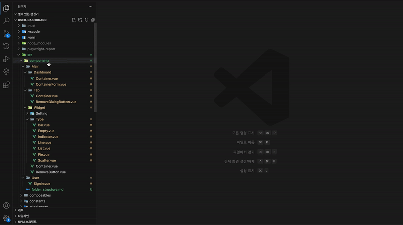

# File List to Table

> area for Logos  

> area for badges  

<p align="center">
    Gitmoji tool for git commit messages in VSCode
</p>

## 💻 Screenshot




## 📦 Install

1. Open [Visual Studio Code](https://code.visualstudio.com/).
2. Press `Ctrl+Shift+X` to open the Extensions tab.
3. Type `File List to Table` to find the extension.
4. Click the `Install` button, then the `Enable` button.

## 🔨 Configuration
### fileListToTable.filePathLabel

```json
// settings.json
"fileListToTable.filePathLabel": "Depth_{0}"
```

### fileListToTable.fileNameLabel

```json
// settings.json
"fileListToTable.fileNameLabel": "File Name"
```

### fileListToTable.columns
JSDoc tag name : header display name

```json
// settings.json
"fileListToTable.columns": {
    "author": "Author",
    "description": "Description",
    "etc": "Etc."
}
```
```vue
// sample.vue
<!--
  @author Croot
  @description This is sample component
  @etc for dev
-->
<template>
    <h1>SAMPLE PAGE</h1>
</template>
```
```markdown
//result
| File Name | Author | Description | Etc. |
| ---------- | ----- | ------------------------ | ------- |
| sample.vue | Croot | This is sample component | for dev |
```

## 📃 License

The project is released under the MIT License, see the [LICENCE](https://github.com/seatonjiang/gitmoji-vscode/blob/main/LICENSE) file for details.